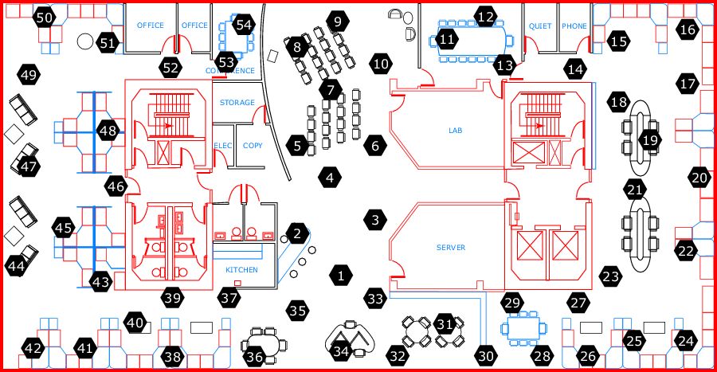
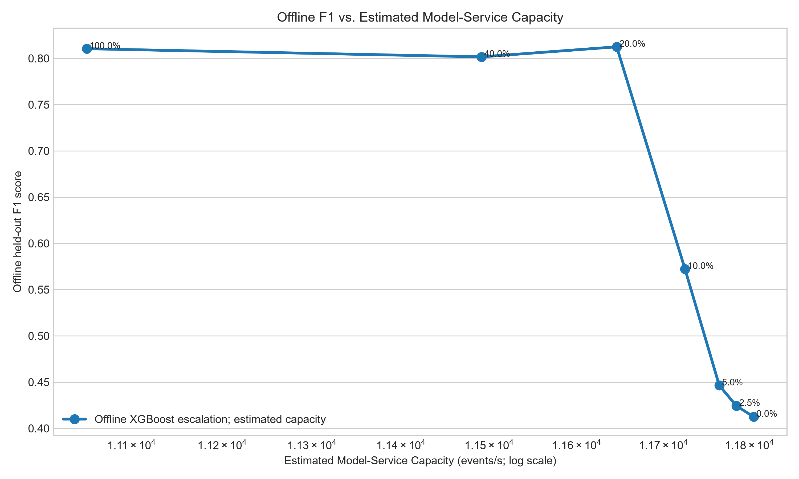

<div align="center">
  <h1>Big Data Technologies (BDT)</h1>
  <p><strong>Real-time IoT anomaly detection with Apache Kafka and Flink</strong></p>
  <p>
    <a href="https://flink.apache.org/"></a>
    <a href="https://kafka.apache.org/"></a>
    <a href="https://onnxruntime.ai/"></a>
    <a href="https://xgboost.readthedocs.io/"></a>
    <a href="LICENSE"></a>
    <a href=".github/workflows/ci.yml"></a>
  </p>
</div>

<p align="center">
  
</p>
<p align="center"><em>Numbered sensor locations across the Intel Lab floor plan.</em></p>

> **Research prototype:** The main BDT path runs in Flink with JVM ONNX Runtime scoring and a local live dashboard. The Laya sidecar is experimental and excluded from the verified run and benchmark. Offline model scores and Flink replay results are reported separately.

## What this project explores

Can a fast first-stage detector preserve streaming capacity while escalating only uncertain sensor readings to a more expressive decision model?

This repository studies that question with Intel Lab telemetry, controlled anomaly injection, Apache Kafka, Apache Flink, ONNX Runtime, XGBoost, Redis, and ClickHouse.

## Two paths in the repository

| Path | Current behavior |
| --- | --- |
| **Fast baseline** | Kafka → keyed online sensor features → Isolation Forest + Autoencoder in Flink/JVM → ClickHouse and Redis. |
| **BDT path** | Uncertain/disagreeing readings escalate to an XGBoost ONNX model in the same Flink/JVM job. |
| **Laya comparison** | Experimental CPU-only Python sidecar branch; its sensor-data accuracy and effect on stream throughput are not verified. |
| **Dashboard** | FastAPI reads live run metrics and event rows from ClickHouse, service health from Redis/Flink, and displays them in a responsive local UI. |

The feature window and model inputs match the Python evaluation contract. See [the architecture notes](docs/ARCHITECTURE.md) for data flow, semantics, and current limitations.

## Run the live demo

Docker Desktop and Python 3.10+ are required. From the repository root:

```bash
python scripts/run_demo.py --mode bdt --limit 5000
```

This builds the Flink job and producer, starts Kafka, Flink, Redis, ClickHouse, and the dashboard, submits the job, and replays labeled held-out sensor rows through Kafka. Open [http://localhost:4173/dashboard/](http://localhost:4173/dashboard/) for live metrics. Use `--mode fast` to run the baseline. The dashboard also includes a clearly labeled offline preview mode.

The Laya comparison remains experimental and is not included in the verified demo or throughput results. Use the fast and BDT modes for the reproducible comparison below.

To measure both Flink paths over the full held-out split and save the results to `experiments/results/streaming_integration_benchmark.csv`:

```bash
python scripts/run_benchmark.py
```

The output reports measured replay throughput and latency alongside F1, precision, and recall from the injected labels. These are local Docker results and can vary with hardware, Docker limits, and startup state.

Latest local run, replaying the same 40,000 events in each mode with an unpaced producer:

| Mode | F1 | False-positive rate | Escalated | Throughput | End-to-end p95 latency |
| --- | ---: | ---: | ---: | ---: | ---: |
| Fast (IF + AE) | 0.4125 | 7.20% | 0% | 1,283 events/s | 29.86 s |
| BDT (IF + AE → XGBoost) | **0.8238** | **1.00%** | 20.51% | 1,332 events/s | 28.99 s |

This is one local run, not a claim that BDT is faster. The p95 includes queueing under the burst replay and is not model-only inference time. The raw measurements are in [`streaming_integration_benchmark.csv`](experiments/results/streaming_integration_benchmark.csv).

## Offline results

The checked-in evaluation uses 40,000 chronological test windows with synthetic injected anomalies (2.85% prevalence). The scores are offline model results, not results from the Java Flink job.

| System | Precision | Recall | F1 | False-positive rate | Escalated |
| --- | ---: | ---: | ---: | ---: | ---: |
| Isolation Forest | 0.1807 | 0.8603 | 0.2986 | 11.43% | 0% |
| IF + Autoencoder | 0.2677 | 0.8989 | 0.4125 | 7.20% | 0% |
| IF + AE → XGBoost | **0.7340** | **0.9385** | **0.8238** | **1.00%** | 20.5% |

The historical System F row in the committed six-system CSV came from a deterministic proxy, not an actual Laya model run. It is marked unverified in the chart and should not be cited as Laya performance. The canonical evaluator calls the real Laya model.

<p align="center">
  
</p>

### Capacity estimate

The sweep chart combines held-out offline F1 scores with a **model-only capacity estimate** calculated from batched Python timings and an assumed transport cap. It does not measure Flink, Kafka, HTTP, or sink throughput.

<p align="center">
  
</p>

## Run the standalone offline replay

The repository includes processed Parquet splits and model artifacts for a quick local replay:

```bash
python -m venv .venv
# Activate the environment, then:
pip install -r requirements.txt
python demo_streaming_pipeline.py --samples 2000
```

This is a quick Python-only replay of prepared features. Use `scripts/run_demo.py` above for the Kafka → Flink pipeline and live dashboard.

## Local service pages

The demo script starts all required containers. Open the [live dashboard](http://localhost:4173/dashboard/) and [Flink job manager](http://localhost:8081). The dashboard API health endpoint is [http://localhost:4173/api/health](http://localhost:4173/api/health).

## Reproduce the offline study

The public checkout does **not** include `data_chronological.parquet`, the raw source expected by preprocessing. Add its provenance, license, and checksum before distributing or regenerating the dataset.

```bash
python preprocessing/inject_anomalies.py --validation-seed 42 --test-seed 43
python experiments/verify_no_leakage.py
python models/train_isolation_forest.py
python models/train_autoencoder.py
python models/train_xgboost_fallback.py
python experiments/evaluate_systems.py
python experiments/plot_benchmark.py
python experiments/streaming_benchmark_sweep.py
```

The seed defaults remain `42/42` for the checked-in snapshot. Use distinct seeds for new experiments, retrain the models, and regenerate the results and figures together. The sweep reports estimated capacity only; its CSV labels that estimate explicitly.

## Project guide

- [Architecture and runtime limitations](docs/ARCHITECTURE.md)
- [Benchmark reproduction and measurement scope](docs/BENCHMARK_REPRODUCTION.md)
- [Mathematical formulation](docs/MATHEMATICAL_FORMULATION.md)
- [Interactive offline notebook](notebooks/01_benchmark_walkthrough.ipynb)
- [Tests](tests/)
- [Security policy](SECURITY.md)

## Dataset and citation

The processed train, validation, and test Parquet files are included. The raw chronological input is not. The dataset-source citation and license should be added when its provenance is confirmed.

```bibtex
@software{bdt_streaming_anomaly_2026,
  author = {Khushalzz},
  title = {{Selective Escalation of Uncertain Streaming Sensor Anomalies via Tiered Decision Architectures}},
  year = {2026},
  url = {https://github.com/Khushalzz/flink-selective-ai-anomaly-detection},
  version = {1.0.0}
}
```

Licensed under Apache-2.0. See [LICENSE](LICENSE).
