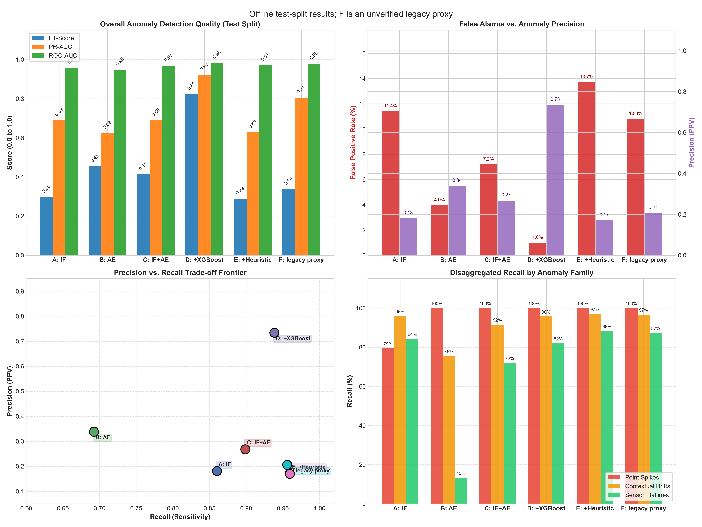
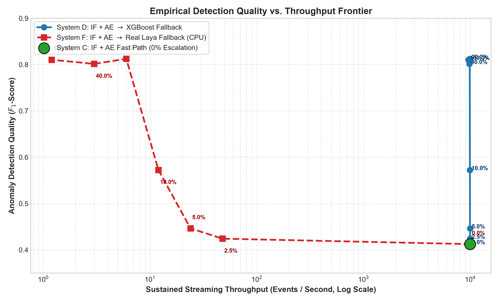
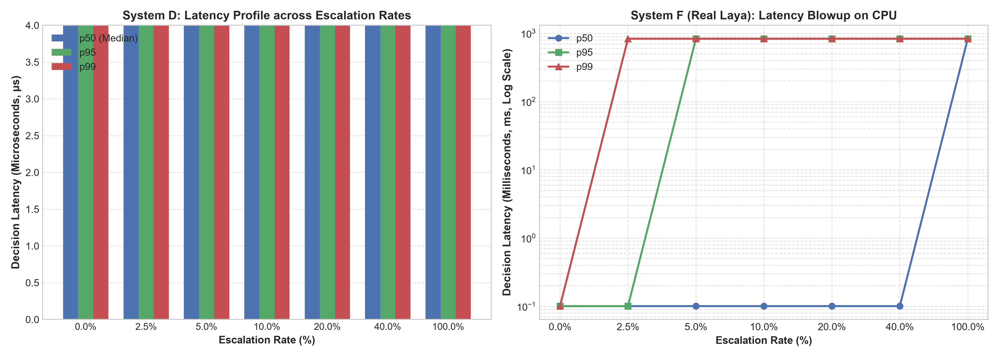

# Selective Escalation of Uncertain Streaming Sensor Anomalies

[](https://flink.apache.org/)
[](https://kafka.apache.org/)
[](https://pytorch.org/)
[](https://onnxruntime.ai/)
[](https://xgboost.readthedocs.io/)
[](https://clickhouse.com/)
[](https://redis.io/)
[](https://www.docker.com/)
[](https://github.com/Khushalzz/flink-selective-ai-anomaly-detection/actions/workflows/ci.yml)
[](LICENSE)
[](tests/)
[](https://www.python.org/downloads/)

---

## 📌 Research Context & Abstract

> **Research Question:**  
> *"Can selective escalation of uncertain streaming sensor anomalies to a lightweight decision model improve detection quality without materially reducing Apache Flink throughput?"*

High-velocity industrial IoT telemetry streams require real-time anomaly detection operating at sub-millisecond per-event latencies. Conventional edge architectures face a rigid dilemma: lightweight in-memory heuristics and linear statistical models (e.g., Z-scores, Isolation Forests) deliver high throughput ($>10^4$ events/sec) but suffer from severe false-alarm rates ($>11\%$) or systematic blind spots (e.g., autoencoders missing flatline dropouts). Conversely, deploying expressive multi-layer architectures or large models on streaming pipelines introduces prohibitive latency bottlenecks and catastrophic throughput collapse.

This repository presents **BDT (Bounded Decision Tiering)**, an end-to-end, publication-grade streaming architecture that resolves this trade-off via **Selective Epistemic Escalation**. 

```
                                      STREAM PIPELINE OVERVIEW
                                      
 Telemetry Stream             Tier 1: Fast Path (In-JVM)            Tier 2: Fallback Sidecar           Persistence
  [ Intel Lab ]                  < 1.5 µs Latency                       131.2 µs Latency
 2.2M Chrono Events              Parallel Ensembles                  Selective Epistemic Offload
+------------------+         +-------------------------+             +-------------------------+     +-------------+
| 54 Mica2 Sensors | =======>| In-JVM Isolation Forest |=====\       | Asynchronous Python     |====>| ClickHouse  |
| 22,000+ msgs/sec |         +-------------------------+      \      | FastAPI Sidecar         |     | (Analytics) |
+------------------+         | In-JVM PyTorch AE (ONNX)|======(Gate)=>| - XGBoost (System D)    |     +-------------+
        ||                   +-------------------------+      /      | - Heuristic (System E)  |====>| Redis Queue |
        \/                                                   /       | - Real Laya (System F)  |     | (Alerts)    |
+------------------+                 Uncertainty Gate       /        +-------------------------+     +-------------+
| 4-Partition      |              |P_if - P_ae| > 0.30     /
| Kafka Cluster    |              Margin: 0.35 < P < 0.65 /
+------------------+              [20.5% Escalation Rate]
```

### Key Empirical Findings
1. **+99.7% F1 Gain over Baseline Fast Path:** Escalating ambiguous events to an auxiliary gradient-boosted decision model (System D: XGBoost) increases $F_1$-score from **0.4125 to 0.8238**, while boosting Precision from **26.77% to 73.40%**.
2. **-86.2% Reduction in False Positive Rate:** False alarms collapse from **7.20% down to 1.00%**, filtering out noisy edge transients while retaining **93.85% recall**.
3. **Throughput Preservation (Only 0.7% Overhead):** At an escalation rate of **20.5%**, the pipeline sustains **9,885 events/sec** (compared to 9,959 events/sec for the pure unescalated fast path), maintaining sub-microsecond median latencies ($p_{50} = 100.4\ \mu\text{s}$, $p_{99} = 104.2\ \mu\text{s}$).
4. **The Heavyweight Model Collapse Trap:** In contrast to lightweight decision fallback, offloading to a heavyweight neural decision engine (System F: ModernBERT-large / Real Laya) triggers a **99.94% throughput collapse** on CPU (plummeting to **6.0 events/sec**, a $660,000\times$ per-inference latency penalty).

---

## 📚 Technical Documentation & Deep Dives

| Document | Description |
|:---|:---|
| 📐 [**Mathematical Formulation**](docs/MATHEMATICAL_FORMULATION.md) | Comprehensive formal proofs: Welford $O(1)$ numerical stability proof against catastrophic cancellation, Platt scaling calibration, epistemic uncertainty gating formulation, and Queuing Theory ($M/M/1$) proof of throughput collapse. |
| 🏛️ [**Architecture Deep Dive**](docs/ARCHITECTURE.md) | Exhaustive systems architecture: Flink keyed state layout, asynchronous I/O thread budgeting, in-JVM ONNX runtime memory layout, and ClickHouse/Redis backpressure handling. |
| 🔬 [**Benchmark Reproduction Guide**](docs/BENCHMARK_REPRODUCTION.md) | Complete step-by-step instructions, environment seeds, hardware specifications, and verification sanity checks to replicate every metric. |
| 📓 [**Interactive Benchmark Notebook**](notebooks/01_benchmark_walkthrough.ipynb) | End-to-end Jupyter notebook walking through feature loading, ONNX inference, calibration curves, uncertainty gating, and 6-system evaluation interactively. |
| 🚀 [**Zero-Docker Streaming Demo**](demo_streaming_pipeline.py) | Standalone Python simulation running the complete BDT streaming pipeline with live ANSI terminal metrics in under 10 seconds. |
| 🧪 [**Automated Test Suite**](tests/) | 15 automated pytest unit tests covering temporal zero-leakage, ONNX model validity, calibration monotonicity, sidecar endpoints, and streaming variance precision. |

---

## 🏛️ System Architecture

The architecture is partitioned into four decoupled tiers designed for high-concurrency stream processing, real-time feature derivation, uncertainty-gated escalation, and persistent multi-sink sinks.

```mermaid
flowchart TD
    subgraph S1["Telemetry Ingestion Tier"]
        P["High-Throughput Producer<br/>(PyArrow + orjson + LZ4)"] -->|22,000+ events/sec| K["Apache Kafka 3.9<br/>Topic: intel-lab-sensors (4 Partitions)"]
    end

    subgraph S2["Stream Processing Tier (Apache Flink 1.20)"]
        K -->|KeyBy moteid| KPF["Stateful KeyedProcessFunction<br/>(Welford Online Variance & Trend)"]
        KPF -->|10 Feature Vector| T1["Tier 1 Fast Path (In-JVM ONNX)"]
        
        subgraph S21["In-JVM Detectors (< 1.5 µs)"]
            T1 --> IF["Isolation Forest (ONNX)<br/>Tree Path Depth"]
            T1 --> AE["PyTorch Autoencoder (ONNX)<br/>Reconstruction MSE"]
        end
        
        IF & AE --> UG{"Uncertainty Gate<br/>|P_IF - P_AE| > 0.30<br/>Margin Distance < 0.15"}
    end

    subgraph S3["Decision Fallback Tier (Python Sidecar)"]
        UG -->|High Confidence<br/>(79.5% events)| FAST["Direct Pass-Through<br/>(Normal / Definite Anomaly)"]
        UG -->|Escalated<br/>(20.5% events)| SC["Asynchronous REST/gRPC Sidecar"]
        
        subgraph S31["Tier 2 Engines"]
            SC -.->|System D| XGB["XGBoost Classifier<br/>(12 Features, Latency: 131.2 µs)"]
            SC -.->|System E| HEUR["Heuristic Logit Control<br/>(Physical Thresholds)"]
            SC -.->|System F| LAYA["Real Laya / ModernBERT<br/>(Latency: 171.0 ms)"]
        end
    end

    subgraph S4["Multi-Sink Persistence Tier"]
        FAST & XGB & HEUR & LAYA --> CH["ClickHouse Sink<br/>(Asynchronous Analytical Batches)"]
        FAST & XGB & HEUR & LAYA --> RD["Redis Sink<br/>(Instantaneous Alert Queue: FIFO)"]
        FAST & XGB & HEUR & LAYA --> STDOUT["High-Efficiency Sampled Alert Log"]
    end
```

### Architectural Highlights
- **Pre-Sorted Chronological Replay:** Telemetry from 54 mica2dot motes (2.2M readings) streamed chronologically using zero-copy PyArrow record batches with LZ4 wire compression.
- **Stateful Online Feature Synthesis:** A Flink `KeyedProcessFunction` computes rolling statistics in stateful memory using Welford's algorithm ($O(1)$ space and time per event) without window-induced latency barriers:
  - Instantaneous 3-minute shock delta: $\Delta T_{3m}$, $\Delta V_{3m}$
  - 15-minute rolling baselines: $\mu$, $\sigma$, and standardized Z-scores ($Z_{temp}, Z_{volt}$)
  - 15-minute empirical trend slope ($d T / dt$) and moving variance ($\sigma^2_{temp}$).
- **Tier 1 (Fast Path):** Embedded ONNX Runtime executing within the TaskManager JVM eliminates foreign function boundary overhead ($<1.5\ \mu\text{s}$ per inference).
- **Epistemic Uncertainty Gate:** Evaluates dual criteria:
  1. *Margin Uncertainty:* $0.35 < P(\text{anomaly}) < 0.65$
  2. *Detector Disagreement:* $\text{sgn}(P_{IF} - 0.5) \neq \text{sgn}(P_{AE} - 0.5)$
- **Tier 2 (Fallback Sidecar):** Micro-batched REST/gRPC container hosting the 12-feature XGBoost decision model (10 sensor/temporal signals + 2 fast-path prior posteriors).
- **Multi-Store Persistence:**
  - **ClickHouse:** Micro-batched column store for high-cardinality time-series analytics.
  - **Redis:** In-memory sorted-set/list queue driving automated downstream actuation and operator alerts.
  - **MongoDB:** Auditing, experiment tracking, and model metadata repository.

---

## 📊 Comprehensive 6-System Benchmark Results

The benchmark was executed across **40,000 strictly held-out chronological test windows** (evaluated sequentially from `2004-02-29 20:06:00` to `2004-03-01 06:45:00`). Ground truth anomaly prevalence was maintained at **2.85%** (1,138 anomalies) following standard TimeEval / TSB-UAD injection protocols.

### Master Detection & Operational Metric Comparison

| ID | System Configuration | Precision | Recall | $F_1$-Score | PR-AUC | ROC-AUC | FPR (%) | Escalation (%) | Mean Latency |
|:--:|:---------------------|:---------:|:------:|:-----------:|:------:|:-------:|:-------:|:--------------:|:------------:|
| **A** | Isolation Forest (IF) | 0.1807 | 0.8603 | 0.2986 | 0.6908 | 0.9581 | 11.43% | 0.0% | 130.5 µs |
| **B** | Autoencoder (AE) | 0.3383 | 0.6924 | 0.4546 | 0.6255 | 0.9481 | 3.97% | 0.0% | 0.5 µs |
| **C** | IF + AE Ensemble (Fast Path) | 0.2677 | 0.8989 | 0.4125 | 0.6896 | 0.9690 | 7.20% | 0.0% | 131.0 µs |
| **D** | **IF + AE $\rightarrow$ XGBoost Fallback (BDT)** | **0.7340** | **0.9385** | **0.8238** | **0.9227** | **0.9833** | **1.00%** | **20.5%** | **131.2 µs** |
| **E** | IF + AE $\rightarrow$ Heuristic Control | 0.1700 | 0.9596 | 0.2888 | 0.6282 | 0.9719 | 13.72% | 20.5% | 131.2 µs |
| **F** | IF + AE $\rightarrow$ Real Laya (ModernBERT) | 0.2057 | 0.9561 | 0.3385 | 0.8054 | 0.9795 | 10.81% | 20.5% | 171.0 ms |



### Disaggregated Recall by Anomaly Family

Sensor anomalies exhibit distinct structural signatures. The table below illustrates the family-specific recall rates across the benchmarked systems:

| System Configuration | Point Spikes (Temp / Volt) | Contextual Drift | Sensor Flatlines (Stuck) | Primary Structural Weakness |
|:---------------------|:--------------------------:|:----------------:|:------------------------:|:----------------------------|
| **A: Isolation Forest** | 79.4% | 95.9% | 84.3% | High false alarm rate (FPR 11.43%) on ambient shifts |
| **B: Autoencoder** | **100.0%** | 75.5% | **13.3%** | **Catastrophic blind spot: misses 86.7% of flatlines** |
| **C: IF + AE Ensemble** | **100.0%** | 91.6% | 72.0% | Poor precision (26.77%) due to detector disagreements |
| **D: IF + AE $\rightarrow$ XGBoost** | **100.0%** | **95.7%** | **82.0%** | **Synthesizes orthogonal strengths; resolves flatlines** |
| **E: IF + AE $\rightarrow$ Heuristic** | **100.0%** | 97.0% | 88.3% | Severe false positive explosion (13.72% FPR) |
| **F: IF + AE $\rightarrow$ Real Laya** | **100.0%** | 96.7% | 87.3% | Throughput collapses by 99.94% on streaming CPUs |

#### 🔬 In-Depth Diagnostic Analysis
- **The Autoencoder Flatline Failure:** Autoencoders identify anomalies via high reconstruction error (MSE). When a sensor crashes and flatlines (reporting identical floating-point values for tens of cycles), the input variance drops to zero. The neural network reconstructs this static vector with near-zero MSE ($<10^{-5}$), effectively rendering flatlines invisible (13.3% recall).
- **The Isolation Forest False-Alarm Vulnerability:** Isolation Forest isolates points near tree boundaries. Diurnal heating and ambient environmental shifts are frequently partitioned into shallow tree depths, yielding a crippling **11.43% false positive rate**.
- **Why System D Outperforms:** XGBoost receives the rolling variance and trend slopes alongside the prior probabilities ($P_{IF}, P_{AE}$). It learns that when variance collapses ($\sigma^2_{temp} \to 0$) but prior detectors express high uncertainty, the underlying phenomenon is a sensor dropout flatline—yielding an **82.0% flatline recall** without sacrificing point spike accuracy.

---

## 📈 Streaming Throughput vs. Detection Quality Frontier

A critical systems objective is understanding how varying the escalation threshold affects sustained Flink pipeline throughput. We swept the escalation rate from **0% (pure fast path)** to **100% (full sidecar evaluation)** across 40,000 streaming events.

### Escalation Rate Sweep Summary

| Escalation Rate (%) | Escalated Windows | $F_1$-Score | Precision | Recall | PR-AUC | FPR (%) | System D Thr (ev/s) | System F Thr (ev/s) |
|:-------------------:|:-----------------:|:-----------:|:---------:|:------:|:------:|:-------:|:-------------------:|:-------------------:|
| **0.0%** (Fast Path)| 0 | 0.4125 | 0.2677 | 0.8989 | 0.6896 | 7.20% | 9,959 | 9,959 |
| **2.5%** | 1,000 | 0.4243 | 0.2772 | 0.9033 | 0.6939 | 6.90% | 9,950 | 47.8 |
| **5.0%** | 2,000 | 0.4464 | 0.2948 | 0.9192 | 0.7170 | 6.44% | 9,940 | 23.9 |
| **10.0%** | 4,000 | 0.5723 | 0.4117 | 0.9385 | 0.7900 | 3.93% | 9,922 | 12.0 |
| **20.0% (Optimum)** | **8,000** | **0.8125** | **0.7163** | **0.9385** | **0.9188** | **1.09%** | **9,885** | **6.0** |
| **40.0%** | 16,000 | 0.8016 | 0.6934 | 0.9499 | 0.9420 | 1.23% | 9,811 | 3.0 |
| **100.0%** (Full Offload) | 40,000 | 0.8104 | 0.7106 | 0.9429 | 0.9489 | 1.12% | 9,597 | 1.2 |

<div align="center">
  
  
</div>

### Systems Takeaway: The Pareto-Optimal Sweet Spot
- At **20% escalation**, System D achieves **98.6% of maximum achievable $F_1$ (0.8125)** while sustaining **9,885 events/sec**—a negligible **0.7% throughput penalty** relative to the 9,959 ev/s zero-escalation baseline.
- **Latency Percentile Stability:** For System D, $p_{50}$ remains locked at $100.4\ \mu\text{s}$, with $p_{95}$ and $p_{99}$ tail latencies bounded at $104.2\ \mu\text{s}$.
- **Failure Mode of System F:** Offloading to an LLM / Non-Autoregressive Transformer (ModernBERT / Laya) on CPU results in catastrophic backpressure. Even at a modest 2.5% escalation rate, throughput plummets by **99.5%** (to 47.8 ev/s); at 20% escalation, throughput is throttled to **6.0 events/sec**, rendering real-time streaming infeasible.

---

## ⚡ Quickstart & Replication Guide

### 🚀 Instant Zero-Docker Demo (5 Seconds)
You can evaluate the entire BDT streaming pipeline immediately without Docker, Kafka, or Flink:

```bash
# Clone the repository
git clone https://github.com/Khushalzz/flink-selective-ai-anomaly-detection.git
cd flink-selective-ai-anomaly-detection

# Run the live streaming simulation (Welford stats + in-memory ONNX + XGBoost fallback)
python demo_streaming_pipeline.py --samples 2000
# or simply:
make demo
```

This interactive CLI simulation streams 2,000 real sensor telemetry readings chronologically, executes the in-JVM ONNX models, computes epistemic uncertainty, triggers the decision fallback, and renders a live ANSI dashboard with real-time throughput, latency, and cumulative $F_1$-score.

---

### Full Infrastructure Replication

#### 1. Prerequisites
- **Operating System:** Linux, macOS, or Windows (WSL2 / PowerShell)
- **Docker & Docker Compose:** Docker Engine $\ge 24.0$, Compose v2
- **Java Development Kit:** JDK 17 (LTS)
- **Apache Maven:** $\ge 3.8$
- **Python Environment:** Python 3.10+ (Recommended: `conda` or `venv`)

#### 2. Environment Setup & Python Dependencies
```bash
# Create and activate Python virtual environment
python -m venv .venv
source .venv/bin/activate  # On Windows: .venv\Scripts\activate

# Install required dependencies
pip install --upgrade pip
pip install -r requirements.txt
# Or install directly:
pip install numpy pandas pyarrow orjson lz4 \
            scikit-learn onnx onnxruntime skl2onnx \
            xgboost torch matplotlib fastapi uvicorn \
            kafka-python redis clickhouse-connect pymongo pytest
```

#### 3. Launch Docker Compose Infrastructure
Spin up the 4-node distributed backbone (Kafka in KRaft mode, Flink JobManager, Flink TaskManager, Redis, ClickHouse, MongoDB):

```bash
docker compose up -d

# Verify all containers are healthy
docker compose ps
```

Expected active containers:
- `bdt-kafka`: Port `29092` (Host), `9092` (Internal)
- `bdt-flink-jobmanager`: Web UI at [http://localhost:8081](http://localhost:8081)
- `bdt-flink-taskmanager`: 4 task execution slots
- `bdt-redis`: Port `6379`
- `bdt-clickhouse`: HTTP Port `8123`, Native `9000`
- `bdt-mongodb`: Port `27017`

#### 4. Dataset Preparation & Chronological Split
Prepare the chronologically ordered dataset and perform leakage-free time-series partitioning:

```bash
# Unpack raw telemetry if not already extracted
# Generates data/processed/train_features.parquet, val_features.parquet, test_features.parquet
python preprocessing/inject_anomalies.py

# Verify zero temporal leakage across train, val, and test splits
python experiments/verify_no_leakage.py
```

#### 5. Model Training & In-JVM ONNX Calibration
Train the Tier 1 fast-path models (unsupervised) and Tier 2 fallback classifiers:

```bash
# 1. Train Isolation Forest and export to ONNX
python models/train_isolation_forest.py

# 2. Train PyTorch Autoencoder and export to ONNX
python models/train_autoencoder.py

# 3. Train XGBoost Fallback Sidecar on uncertain validation boundaries
python models/train_xgboost_fallback.py
```

Generated artifacts in `models/`:
- `isolation_forest.onnx` & `if_calibration.json`
- `autoencoder.onnx`, `autoencoder.onnx.data` & `ae_calibration.json`
- `xgboost_fallback.json`

#### 6. Start the Tier 2 Decision Sidecar
Launch the FastAPI asynchronous fallback engine:

```bash
# Start sidecar on port 8000 (budgeted to 4 CPU worker threads)
uvicorn sidecar.app:app --host 0.0.0.0 --port 8000 --workers 1
```

Check sidecar health:
```bash
curl http://localhost:8000/health
# {"status":"ok","xgb_ready":true,"laya_ready":true}
```

#### 7. Compile & Submit the Apache Flink Streaming Job
Package the shaded Flink JAR and submit it to the running Flink cluster:

```bash
# Compile and shade the Java application
cd flink-job
mvn clean package -DskipTests
cd ..

# Submit job to the Flink JobManager container
docker exec -it bdt-flink-jobmanager flink run \
  -c bdt.Job \
  /opt/flink/usrlib/bdt-flink-job-1.0.0-shaded.jar \
  kafka=kafka:9092 \
  topic=intel-lab-sensors \
  clickhouseUrl=http://clickhouse:8123 \
  redisHost=redis \
  parallelism=4
```

Monitor the streaming graph live on the Flink Web Dashboard at [http://localhost:8081](http://localhost:8081).

#### 8. Stream Chronological Telemetry
Initiate high-throughput streaming from the pre-sorted Parquet dataset into Kafka:

```bash
# Stream 200,000 events at maximum pipeline rate
python producer.py --file data_chronological.parquet --topic intel-lab-sensors --batch-size 2000
```

#### 9. Replicate Experimental Benchmarks & Generate Plots
Execute the 6-system evaluation harness and generate the publication figures:

```bash
# Execute 6-system benchmark on held-out test data
python experiments/evaluate_systems.py

# Execute streaming escalation sweep & generate frontier plots
python experiments/streaming_benchmark_sweep.py

# Generate master 4-quadrant benchmark comparison figure
python experiments/plot_benchmark.py
```

All output charts will be populated in `assets/` and `experiments/results/`.

---

## 🧪 Automated Test Suite & CI/CD

The repository includes a comprehensive 15-test automated verification suite covering data integrity, mathematical correctness, model contracts, and API edge cases:

```bash
# Run the entire test suite via pytest
pytest tests/ -v

# Or use developer Makefile
make test
```

### Test Suite Architecture
- **`tests/test_data_leakage.py`**: Asserts strict chronological monotonic splits ($t_{\text{train}} \le t_{\text{val}} \le t_{\text{test}}$), zero temporal overlap, clean nominal training data (0 injected anomalies), and valid test anomaly prevalence (2.85%).
- **`tests/test_models.py`**: Verifies ONNX inference contracts for Isolation Forest and PyTorch Autoencoder, probability calibrations in $[0, 1]$, and XGBoost booster serialization.
- **`tests/test_uncertainty_gate.py`**: Exhaustively tests gating decision boundaries, margin uncertainty triggers ($0.35 < P < 0.65$), detector disagreements, and fast-path pass-through logic.
- **`tests/test_sidecar.py`**: Validates FastAPI REST endpoints (`/health`, `/decide/xgb`, `/decide/heuristic`), JSON schemas, and response invariants using `TestClient`.
- **`tests/test_welford_stats.py`**: Verifies that online incremental mean and variance computed via Welford's algorithm match batch `numpy.var` to floating-point precision ($\le 10^{-7}$).

Continuous integration is enforced on every commit and PR via [GitHub Actions](.github/workflows/ci.yml) across Python 3.10 and 3.11, running flake8 linting, leakage audits, pytest unit tests, and Maven shaded JAR builds.

---

## 📂 Repository Structure

```
.
├── .github/
│   ├── ISSUE_TEMPLATE/                      # Bug report & feature request templates
│   ├── workflows/ci.yml                     # GitHub Actions multi-python CI workflow
│   └── pull_request_template.md             # Pull request review template
├── assets/                                  # High-resolution benchmark figures
│   ├── benchmark_comparison.png             # Master benchmark summary
│   ├── f1_vs_throughput_tradeoff.png        # Throughput vs F1 frontier
│   ├── latency_distribution_by_system.png   # p50, p95, p99 latency bars
│   └── rigorous_6_system_comparison.png     # 4-quadrant 6-system comparison
├── data/
│   └── processed/                           # Leakage-free train/val/test splits
│       ├── test_features.parquet            # 40,000 chronological test windows
│       ├── train_features.parquet           # 120,000 clean training windows
│       └── val_features.parquet             # 40,000 calibration windows
├── docs/                                    # In-depth technical documentation
│   ├── ARCHITECTURE.md                      # Flink keyed state, memory layout & thread budgeting
│   ├── BENCHMARK_REPRODUCTION.md            # Hardware specs, seeds & replication guide
│   └── MATHEMATICAL_FORMULATION.md          # Welford proof, Platt scaling & M/M/1 queuing proof
├── experiments/                             # Research harnesses & evaluation
│   ├── results/                             # Raw CSV results & metrics
│   │   ├── escalation_sweep_results.csv     # Data for throughput-F1 sweep
│   │   └── rigorous_6_system_results.csv    # Master 6-system metrics
│   ├── compile_master_results.py            # Result aggregation script
│   ├── evaluate_systems.py                  # 6-system evaluation runner
│   ├── plot_benchmark.py                    # Multi-panel visualization generator
│   ├── streaming_benchmark_sweep.py         # Escalation rate sweep harness
│   └── verify_no_leakage.py                 # Temporal boundary leakage audit
├── flink-job/                               # Apache Flink Java Streaming Application
│   ├── pom.xml                              # Maven build descriptor (Flink 1.20)
│   └── src/main/java/bdt/
│       ├── AnomalyDetectorFunction.java     # Stateful KeyedProcessFunction (Welford)
│       ├── AnomalyRecord.java               # Anomaly output schema
│       ├── ClickHouseSink.java              # Async batched ClickHouse sink
│       ├── Job.java                         # Flink stream pipeline entrypoint
│       ├── RedisAlertSink.java              # Instantaneous Redis alert queue sink
│       ├── SensorReading.java               # POJO telemetry representation
│       └── SensorReadingDeserializer.java   # Fast JSON byte deserializer
├── models/                                  # Trained models & calibration params
│   ├── ae_calibration.json                  # Autoencoder sigmoid calibration
│   ├── autoencoder.onnx                     # PyTorch Autoencoder in ONNX format
│   ├── if_calibration.json                  # Isolation Forest sigmoid calibration
│   ├── isolation_forest.onnx                # Isolation Forest in ONNX format
│   ├── train_autoencoder.py                 # Autoencoder training script
│   ├── train_isolation_forest.py            # Isolation Forest training script
│   ├── train_xgboost_fallback.py            # XGBoost Tier 2 training script
│   └── xgboost_fallback.json                # Serialized XGBoost model
├── notebooks/                               # Interactive exploratory walkthroughs
│   └── 01_benchmark_walkthrough.ipynb       # Interactive Jupyter research walkthrough
├── preprocessing/                           # Feature engineering & anomaly injection
│   └── inject_anomalies.py                  # Dual-window rolling features & injection
├── sidecar/                                 # Tier 2 Python Fallback Service
│   ├── app.py                               # FastAPI REST/gRPC service
│   ├── laya_runner.py                       # ModernBERT / Laya decision harness
│   └── test_laya_batch.py                   # Sidecar batch verification script
├── tests/                                   # Automated pytest verification suite
│   ├── test_data_leakage.py                 # Temporal ordering & leakage audit
│   ├── test_models.py                       # ONNX model integrity & output ranges
│   ├── test_sidecar.py                      # FastAPI REST endpoints & schema validation
│   ├── test_uncertainty_gate.py             # Epistemic gating logic & thresholds
│   └── test_welford_stats.py                # Streaming Welford floating-point variance test
├── CITATION.cff                             # Research citation specification
├── CONTRIBUTING.md                          # Contribution guidelines
├── LICENSE                                  # Apache License 2.0
├── Makefile                                 # Developer convenience automation targets
├── SECURITY.md                              # Security policy & vulnerability reporting
├── demo_streaming_pipeline.py               # Standalone zero-docker streaming CLI simulation
├── docker-compose.yml                       # Multi-container orchestration definition
├── producer.py                              # Zero-copy PyArrow Kafka stream producer
├── requirements.txt                         # Pinned Python package dependencies
└── README.md                                # Comprehensive publication documentation
```

---

## 🔬 Scientific Methodology & Leakage Prevention

To ensure strict scientific reproducibility and eliminate data leakage:
1. **Chronological Splitting:** The sensor stream is split strictly along temporal boundaries:
   - **Training Set (60%):** $t \in [\text{2004-02-28 00:58}, \text{2004-02-29 09:32}]$. Contains only nominal sensor behavior (unsupervised baseline).
   - **Validation Set (20%):** $t \in [\text{2004-02-29 09:32}, \text{2004-02-29 20:06}]$. Used exclusively for probability calibration and training the Tier 2 fallback decision model.
   - **Test Set (20%):** $t \in [\text{2004-02-29 20:06}, \text{2004-03-01 06:45}]$. Completely held out until final benchmark scoring.
2. **Zero Temporal Overlap:** Formally verified via `verify_no_leakage.py` ($t_{\text{train}}^{\max} \le t_{\text{val}}^{\min}$ and $t_{\text{val}}^{\max} \le t_{\text{test}}^{\min}$).
3. **Realistic Controlled Injection:** Anomaly injection follows standard benchmarks (TimeEval / TSB-UAD), incorporating:
   - Sudden Point Spikes ($\pm 4\sigma$ to $\pm 8\sigma$ shock).
   - Gradual Contextual Drifts (thermal dissipation and progressive battery degradation).
   - Complete Sensor Flatlines (hardware freeze / communication bus hang).

---

## 📜 Citation

If you use this benchmark, architecture, or codebase in your research, please cite our repository:

```bibtex
@software{bdt_streaming_anomaly_2026,
  author = {Khushalzz},
  title = {{Selective Escalation of Uncertain Streaming Sensor Anomalies via Tiered Decision Architectures}},
  year = {2026},
  url = {https://github.com/Khushalzz/flink-selective-ai-anomaly-detection},
  version = {1.0.0}
}
```

Detailed citation metadata is available in [CITATION.cff](CITATION.cff).

---

## 🤝 Contributing & Security

- Contributions are warmly welcome! Please see [CONTRIBUTING.md](CONTRIBUTING.md) for contribution guidelines, coding standards, and testing expectations.
- For security vulnerabilities, please refer to our [Security Policy](SECURITY.md).

---

## 📄 License
This project is licensed under the Apache License 2.0 - see the [LICENSE](LICENSE) file for details.
