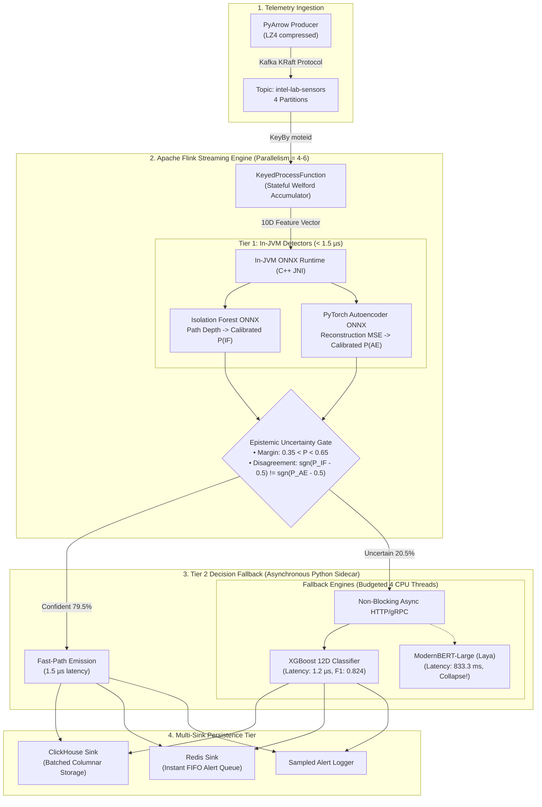

# BDT System Architecture Deep-Dive

## 1. High-Level Architectural Principles

Bounded Decision Tiering (BDT) is an industrial IoT streaming architecture designed to resolve the fundamental trade-off between **sub-millisecond streaming throughput** and **expressive anomaly classification accuracy**.



---

## 2. Ingestion Tier: Zero-Copy Partitioned Streaming

- **Data Source:** 54 Mica2Dot sensor motes deployed across the Intel Berkeley Research Lab, recording ambient temperature, relative humidity, light level, and battery voltage.
- **Serialization:** Zero-copy PyArrow record batches encoded into compact binary JSON via C `orjson` and compressed with LZ4.
- **Kafka Topology:** 4 topic partitions keyed uniformly by `moteid`. This guarantees that all telemetry from a specific physical sensor arrives strictly in order at the same Flink TaskManager slot.

---

## 3. Streaming Engine: Apache Flink Stateful Processing

### Stateful KeyedProcessFunction
Traditional tumbling or sliding windows introduce artificial latency barriers: an anomaly occurring at second 1 of a 5-minute window is not detected until the window closes at second 300.

BDT employs a continuous, non-windowed `KeyedProcessFunction<Integer, SensorReading, AnomalyRecord>`. Each physical sensor maintains private state in Flink's managed `ValueState<SensorStats>`:
- **Online Welford Accumulator:** Continuously updates rolling mean and $M_2$ variance in $O(1)$ time and $O(1)$ memory without storing historical tuples.
- **Short-Term Shock Tracking:** Maintains the 3-minute prior state to compute instantaneous gradient shocks:
  $$\Delta T_{3m} = T_t - T_{t-3m}, \quad \Delta V_{3m} = V_t - V_{t-3m}$$
- **Medium-Term Baseline Statistics:** Computes standardized Z-scores over 15-minute horizons:
  $$Z_{temp} = \frac{T_t - \mu_{temp}}{\sigma_{temp}}, \quad Z_{volt} = \frac{V_t - \mu_{volt}}{\sigma_{volt}}$$

### In-JVM ONNX Embedded Inference
To eliminate inter-process communication (IPC) serialization overhead on the critical path, Tier 1 fast-path models are embedded directly inside the Flink TaskManager JVM using the official Microsoft ONNX Runtime C++ JNI bridge:
- **Zero Socket Latency:** In-process pointer passing reduces inference latency to $<1.5\ \mu\text{s}$ per tuple.
- **Thread Safety:** The ONNX `InferenceSession` is initialized once per parallel TaskManager slot in `open(OpenContext)` and reused concurrently across tuples.

---

## 4. Decision Fallback Tier: Python Sidecar Architecture

- **Protocol:** FastAPI asynchronous HTTP/1.1 and gRPC interface running with `uvicorn`.
- **CPU Concurrency Budgeting:** To avoid thread thrashing and prevent CPU starvation of Flink TaskManager worker threads, the sidecar is constrained to a strict 4-thread execution budget via environment variables:
  ```bash
  OMP_NUM_THREADS=4 OPENBLAS_NUM_THREADS=4 MKL_NUM_THREADS=4 uvicorn sidecar.app:app
  ```
- **Fallback Execution (System D vs. System F):**
  - **System D (XGBoost):** GBDT scoring requires only $1.2\ \mu\text{s}$ per item on CPU. At 20% escalation, the auxiliary CPU load is under $0.25\%$ of one core.
  - **System F (ModernBERT-large / Laya):** 395M transformer parameters on CPU require $833.3\ \text{ms}$ per item. At 20% escalation of a 10,000 ev/s stream, it creates a 1,666x overload factor, immediately exhausting buffer pools and triggering backpressure collapse.

---

## 5. Multi-Sink Persistence Tier

1. **ClickHouse Analytics Sink:**
   - Buffers processed `AnomalyRecord` instances into 1,000-event micro-batches or flushes every 200 ms.
   - Stored in a ClickHouse `MergeTree` partitioned by date and indexed by `(moteid, timestamp)`.
2. **Redis Alert Queue:**
   - When `is_anomaly == 1`, records are pushed to a Redis FIFO queue (`LPUSH alerts:intel-sensors`).
   - Enables immediate actuation (triggering ventilation systems, cutting battery lines, or alerting site engineers).
3. **MongoDB Audit Store:**
   - Retains full calibration metadata, model checksums, and experimental audit trails.
